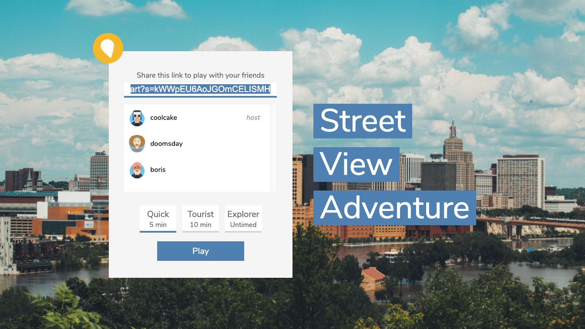
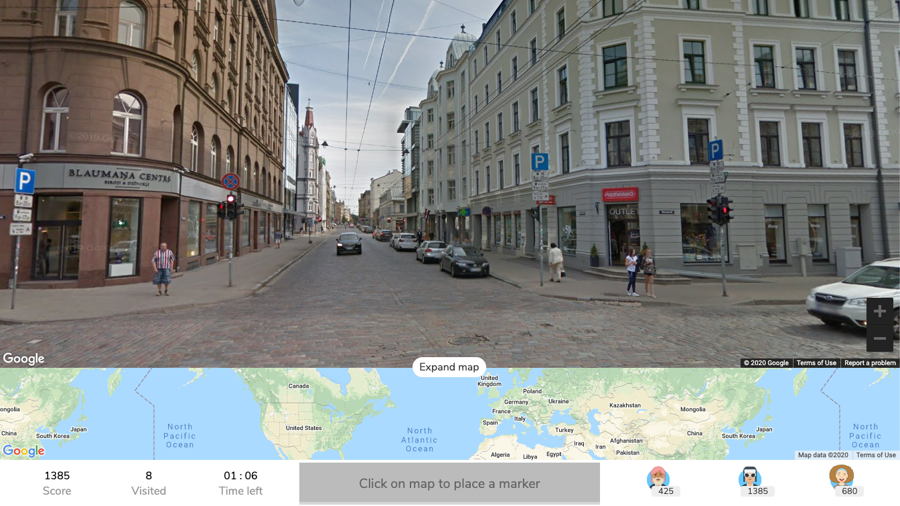

# Street View Adventure
A web-based geography guessing game inspired by [GeoGuessr](https://www.geoguessr.com/) with account-less multiplayer and (virtually) unlimited locations. Players are placed in a semi-random Street View location and are required to guess as many locations as they can by looking for clues in the interactive panorama before the time runs out.

Play it here: https://sva.bkud.dev/

## Stack
Street View Adventure utilizes the Google Maps JavaScript API and React.js bundled with Parcel and Sass. Firebase is used as a backend for data and session storage.
